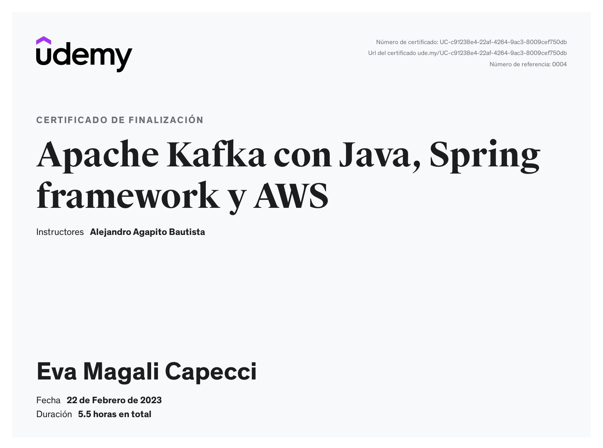
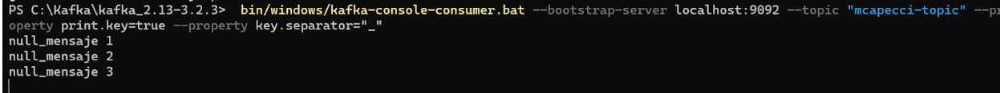
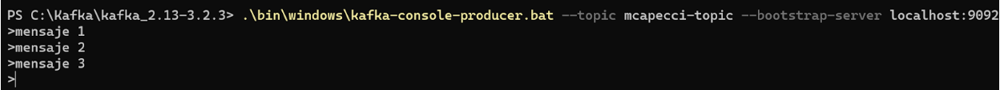
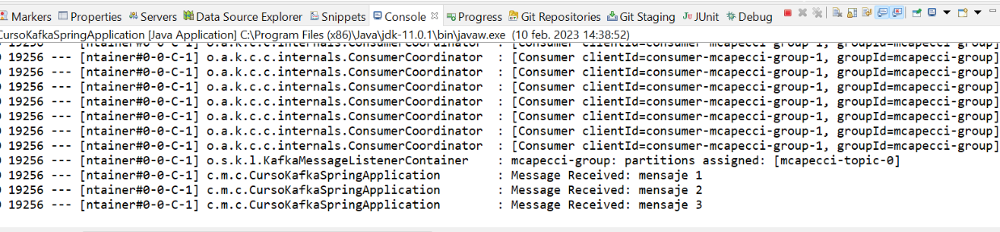

## Kafka con Spring Boot

* Java 11
* Spring Boot 2.7.8

### Ejecutar el servicio ###

Ejecutar la aplicación desde `CursoKafkaSpringApplication` Run As --> Java Application

Comandos para windows
1. Iniciar **zookeeper** `PS C:\Kafka\kafka_2.13-3.2.3> .\bin\windows\zookeeper-server-start.bat .\config\zookeeper.properties`
2.  Iniciar **kafka server** `PS C:\Kafka\kafka_2.13-3.2.3> .\bin\windows\kafka-server-start.bat .\config\server.properties`
3.  Iniciar **consumidor**  `PS C:\Kafka\kafka_2.13-3.2.3>  bin/windows/kafka-console-consumer.bat --bootstrap-server localhost:9092 --topic "mcapecci-topic" --property print.key=true --property key.separator="_"`
4.  Iniciar **productor** `PS C:\Kafka\kafka_2.13-3.2.3> .\bin\windows\kafka-console-producer.bat --topic mcapecci-topic --bootstrap-server localhost:9092`

